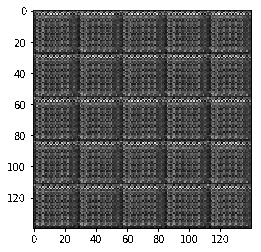
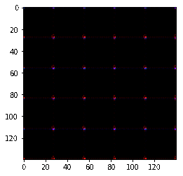

# Handwritten Digits and Faces Generation Using GANs

		

## Project Overview

In this project, I've completed a jupyter notebook as a part of Udacity's Deep Learning Nanodegree. The code in the notebook allows the generation of new numerical digits and faces using Generative Adversarial Networks.

In order to generate handwritten digits, I trained the network using the [MNIST](http://yann.lecun.com/exdb/mnist/) dataset. In order to generate human faces, I trained the network using the [CelebA](http://mmlab.ie.cuhk.edu.hk/projects/CelebA.html) dataset. After training, the Neural Network is able to generate completely new handwritten digits and human faces!

As mentioned, the model's architecture is based on Generative Adversarial Networks consisting of a basic Generator and Discriminator architecture based on the original [DCGAN](https://arxiv.org/abs/1511.06434) paper. 

After training for 3 epochs, below you can see an animation of different digits that I got after every 10 iterations. You can see how after every few iterations, the handwritten become more realistic.

After training for 2 epochs, below you can see an animation of different faces that I got after every 10 iterations. You can see how after every few iterations, the faces become more detailed. Also, if you look at the images generated during the last iterations, you can see that in addition to detailed faces, the network starts to generate faces with accessories such as hats and sunglasses! 

In order to see each image separately from the animations, you can take a look at the dlnd_face_generation.html file. 

## Project Instructions

### Instructions

In order to train the model and generate new handwritten digits and human faces, run all cells in the notebook. I recommend you use a GPU when training the Network.

